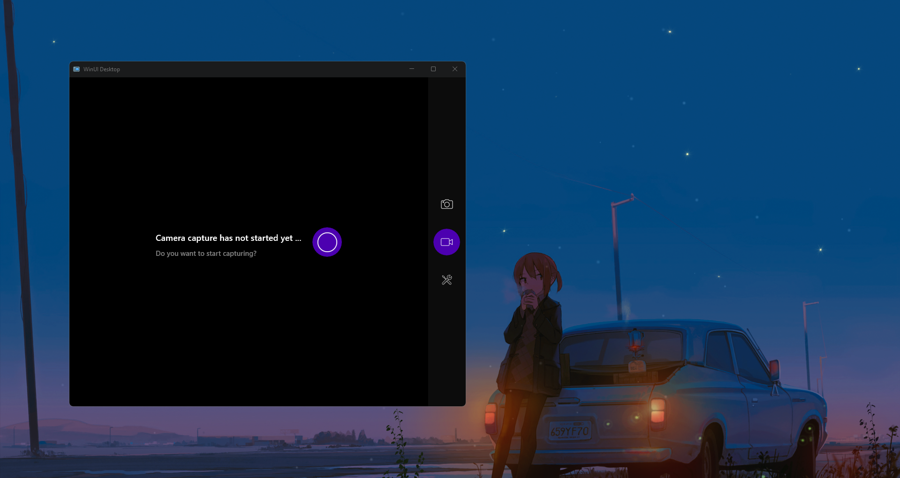
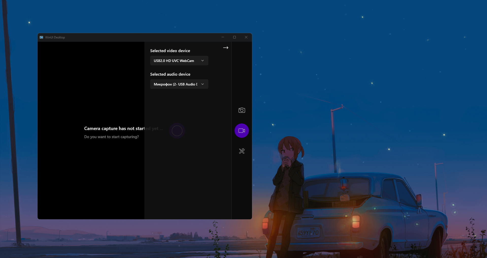
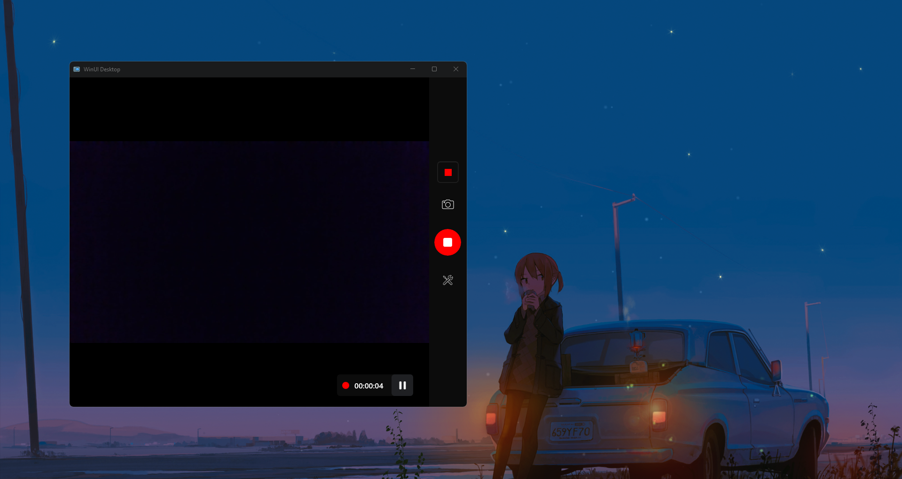

# "Media Capture" project description:

**"Media Capture"** is a pet project, a demo application for recording video from a selected web camera. Developed using **Windows App SDK WinUI3**. The main functionality includes:
- Video capture
- Video record
- Take a snapshot

## How to use the application:
To select the camera and microphone to capture, you need to click on the button with the **tools icon** on the panel on the right side.

To start capturing video from the selected camera, click on the button in the centre of the window. And now the option of recording video and saving snapshots from the camera is opened for the user.

By clicking on the button in the middle of the right panel with the **icon of the video camera**, you can start recording, then in the lower right corner you can see the **pause button** and the **duration of the recorded video**. When the recording is finished, the video will be **saved to the system folder Videos**.

To take a picture from the camera you just need to press the button with the **camera icon** on the right panel and the picture will be **saved to the system Pictures folder.**

### Conclusion:
To summarise the above, it should be said that this project is a simple demonstration pet-project.