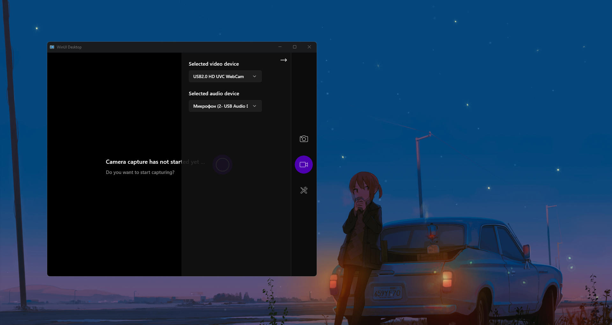
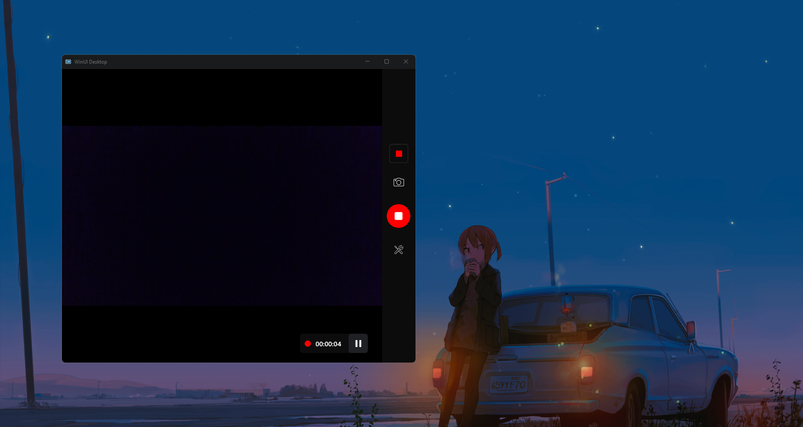

# Опис проекту "Media Capture":

## Мови
- [English](./README.md)
- [Русский](./README_RU.md)
- [Українська](./README_UA.md)

**"Media Capture"** - проектний додаток для запису відео з обраної веб-камери. Розроблено з використанням **Windows App SDK WinUI3**. Основний функціонал включає в себе:
- Захоплення відео
- Запис відео
- Зробити знімок

## Як користуватися додатком:
Щоб вибрати камеру та мікрофон для зйомки, потрібно натиснути на кнопку з іконкою **інструменти** на панелі праворуч.

Щоб почати захоплення відео з обраної камери, натисніть на кнопку в центрі вікна. І тепер користувачеві відкривається можливість запису відео та збереження знімків з камери.

Натиснувши на кнопку посередині правої панелі з **іконкою відеокамери**, можна почати запис, після чого в правому нижньому куті з'явиться **кнопка паузи** і **тривалість записуваного відео**. Після завершення запису відео буде **збережено в системну папку Videos**.

Для того, щоб зробити знімок з камери, достатньо натиснути на кнопку із зображенням **камери** на правій панелі і знімок буде **збережено в системну папку Зображення.**.

## Висновок:
Підсумовуючи вищесказане, слід сказати, що цей проект є простим демонстраційним пет-проектом.
